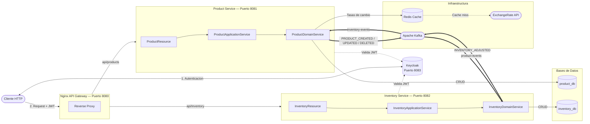

# Sistema de Gestión de Inventarios y Productos

> Solución de microservicios con **Java 21**, **Quarkus 3.x** y **Arquitectura Hexagonal**.

Monorepo con dos microservicios independientes sincronizados mediante eventos, protegidos con JWT, expuestos a través de un API Gateway y desplegados completamente con Docker Compose.

---

## 🏛️ Arquitectura del Sistema

El proyecto sigue estrictamente los principios de la **Arquitectura Hexagonal (Puertos y Adaptadores)**, **SOLID** y **Clean Code**.



### Decisiones de diseño clave

| Principio | Implementación |
| :--- | :--- |
| **Arquitectura Hexagonal** | Dominio en Java puro (`domain/`). La infraestructura (JPA, Kafka, Redis, REST) se implementa como adaptadores en `infrastructure/`. El dominio nunca depende del framework. |
| **Application Service** | Capa intermedia entre el controller REST y el domain service. Centraliza todo el mapeo DTO↔dominio, dejando los controllers sin lógica de transformación ni imports de dominio. |
| **RBAC con JWT** | Rol `Admin`: escritura completa. Rol `User`: solo lectura. Validación via `@RolesAllowed` con tokens JWT emitidos por Keycloak. |
| **Event-Carried State Transfer (ECST)** | Ambos servicios mantienen réplicas locales de datos del otro: Inventory guarda `name`, `price` y `category` del producto; Product guarda `currentStock`. Ambos se actualizan via eventos Kafka. Elimina todas las llamadas HTTP síncronas entre servicios. |
| **Eventos asíncronos completos** | `PRODUCT_CREATED` → inicializa stock. `PRODUCT_UPDATED` → actualiza datos del producto en inventario. `PRODUCT_DELETED` → elimina registro. `INVENTORY_ADJUSTED` → actualiza stock local en Product Service. |
| **Tipos seguros en eventos** | `ProductEventType` enum en el publisher. `MovementType` enum (ENTRY/EXIT) con `@Enumerated(EnumType.STRING)` en la entidad JPA. Elimina magic strings en el dominio. |
| **Consumidor idempotente** | Los IDs de eventos se registran en la tabla `processed_event` dentro de una transacción atómica, evitando doble procesamiento en reintentos de Kafka. |
| **Locking pesimista** | `adjustStock` usa `SELECT FOR UPDATE` (`LockModeType.PESSIMISTIC_WRITE`) para prevenir sobreajuste de stock en requests concurrentes. |
| **Caché multicapa con TTL** | Listas de productos, detalles, stock e historial cacheados en Redis con TTL explícito por cache. Invalidación automática en escrituras. |
| **Exception handling** | Excepciones de dominio (`NotFoundException`, `ConflictException`, `BadRequestException`) propagadas sin try/catch en controllers ni Application Services. JAX-RS `ExceptionMapper` las convierte a HTTP con log estructurado. `UnhandledExceptionMapper` actúa como fallback para errores inesperados (ej. `PersistenceException`) evitando el 500 vacío por defecto de Quarkus. |

---

## 🛠️ Stack Tecnológico

### Servicios e infraestructura

| Servicio | Puerto externo | Puerto interno | Tecnología |
| :--- | :---: | :---: | :--- |
| **Nginx API Gateway** | `8080` | `8080` | nginx:alpine — Proxy inverso |
| **Product Service** | `8081` | `8081` | Quarkus 3.35 / Java 21 |
| **Inventory Service** | `8082` | `8082` | Quarkus 3.35 / Java 21 |
| **Keycloak** | `8083` | `8080` | Keycloak 24.0.5 — OAuth2/OIDC |
| **PostgreSQL** | `5432` | `5432` | PostgreSQL 15 — `product_db` y `inventory_db` |
| **Apache Kafka** | `9092` | `9092` | Confluent Kafka 7.5.0 KRaft (sin Zookeeper) |
| **Redis** | `6379` | `6379` | Redis 7 — Backend de caché con TTL |

### Librerías y frameworks

| Categoría | Librería | Versión |
| :--- | :--- | :--- |
| **Framework** | Quarkus | 3.35.3 |
| **Lenguaje** | Java | 21 |
| **API REST** | Quarkus REST (RESTEasy Reactive) | 3.35.3 |
| **Persistencia ORM** | Hibernate ORM con Panache | 3.35.3 |
| **Driver base de datos** | Quarkus JDBC PostgreSQL | 3.35.3 |
| **Mensajería** | SmallRye Reactive Messaging (Kafka) | 3.35.3 |
| **Caché** | Quarkus Cache + Redis backend | 3.35.3 |
| **Seguridad** | Quarkus OIDC | 3.35.3 |
| **Validación** | Hibernate Validator (Jakarta Validation) | 3.35.3 |
| **Serialización** | Jackson (quarkus-rest-jackson) | 3.35.3 |
| **Utilidades** | Lombok | 1.18.38 |
| **Testing** | JUnit 5 + Mockito + REST Assured | 3.35.3 |
| **Cobertura** | JaCoCo (`quarkus-jacoco` + `jacoco-maven-plugin` 0.8.12) | 3.35.3 / 0.8.12 |
| **Logging JSON** | `quarkus-logging-json` | 3.35.3 |

---

## 🗄️ Base de Datos y Esquema

### Estrategia por entorno

| Perfil | `schema-management.strategy` | Comportamiento |
| :--- | :--- | :--- |
| `%prod` | `update` | Hibernate agrega columnas nuevas sin borrar datos. El esquema base lo crea `init-db.sql`. |
| `%dev` | `update` | Hibernate crea y actualiza tablas automáticamente. |
| `%test` | `drop-and-create` | Esquema limpio en cada ejecución. Garantiza tests reproducibles. |

### Esquema de tablas

**`product_db`**

| Tabla | Columnas clave |
| :--- | :--- |
| `product` | `id`, `name`, `description`, `price`, `category`, `sku` (UNIQUE), `current_stock` (ECST) |
| `price_history` | `id`, `product_id`, `price`, `changed_at` |

**`inventory_db`**

| Tabla | Columnas clave |
| :--- | :--- |
| `inventory` | `id`, `product_id` (UNIQUE), `quantity`, `product_name`, `product_price`, `product_category` |
| `inventory_movement` | `id`, `product_id`, `quantity_change`, `movement_type` (ENTRY/EXIT), `created_at` |
| `processed_event` | `event_id` (PK), `processed_at` |

> `product.current_stock` se sincroniza via eventos `INVENTORY_ADJUSTED` desde el Inventory Service (ECST).  
> `inventory.product_name/price/category` se sincronizan via eventos `PRODUCT_CREATED/UPDATED` desde el Product Service (ECST).

El script completo `init-db.sql` en la raíz define todas las tablas con sus tipos, constraints e índices compuestos.

---

## 📁 Estructura del Proyecto

```
Inventrio/
├── docker-compose.yml
├── nginx.conf
├── init-db.sql
├── keycloak-realm.json
├── inventrio_postman_collection.json
│
├── product-service/
│   └── src/main/java/com/inventrio/product/
│       │
│       ├── domain/                              ← Núcleo del negocio (Java puro, sin frameworks)
│       │   ├── exception/
│       │   │   ├── BadRequestException.java
│       │   │   ├── ConflictException.java
│       │   │   └── NotFoundException.java
│       │   ├── model/
│       │   │   ├── Product.java                 ← incluye currentStock (ECST)
│       │   │   ├── PriceHistory.java
│       │   │   └── ProductEventType.java        ← enum PRODUCT_CREATED/UPDATED/DELETED
│       │   ├── port/
│       │   │   ├── in/
│       │   │   │   └── ProductUseCase.java
│       │   │   └── out/
│       │   │       ├── ExchangeRatePort.java
│       │   │       ├── ProductEventPublisherPort.java
│       │   │       └── ProductRepositoryPort.java
│       │   └── service/
│       │       └── ProductDomainService.java
│       │
│       ├── application/                         ← Capa de aplicación (mapeo DTO↔dominio)
│       │   ├── ProductApplicationService.java
│       │   ├── ProductRequest.java
│       │   ├── ProductResponse.java
│       │   ├── PriceHistoryResponse.java
│       │   ├── StockResponse.java
│       │   └── ErrorResponse.java
│       │
│       └── infrastructure/                      ← Adaptadores externos
│           ├── adapter/
│           │   ├── in/
│           │   │   ├── event/                   ← Consumer Kafka (inventory-events)
│           │   │   │   ├── InventoryAdjustedEvent.java
│           │   │   │   ├── InventoryEventConsumer.java
│           │   │   │   └── InventoryEventDeserializer.java
│           │   │   └── rest/                    ← Adaptador REST de entrada
│           │   │       ├── ProductResource.java
│           │   │       └── exception/
│           │   │           ├── BadRequestExceptionMapper.java
│           │   │           ├── NotFoundExceptionMapper.java
│           │   │           ├── ConflictExceptionMapper.java
│           │   │           └── ConstraintViolationExceptionMapper.java
│           │   └── out/
│           │       ├── client/                  ← Adaptador cliente REST (solo ExchangeRate)
│           │       │   ├── ExchangeRateAdapter.java
│           │       │   ├── ExchangeRateApiClient.java
│           │       │   └── ExchangeRateResponse.java
│           │       ├── event/                   ← Adaptador Kafka (publicador)
│           │       │   ├── KafkaProductEventPublisher.java
│           │       │   └── ProductEvent.java
│           │       └── persistence/             ← Adaptador JPA/Panache + Caché
│           │           ├── PostgresProductRepositoryAdapter.java
│           │           ├── ProductEntity.java
│           │           ├── PriceHistoryEntity.java
│           │           ├── PanacheProductRepository.java
│           │           └── PanachePriceHistoryRepository.java
│           └── config/
│               └── ProductServiceConfig.java
│
└── inventory-service/
    └── src/main/java/com/inventrio/inventory/
        │
        ├── domain/                              ← Núcleo del negocio (Java puro, sin frameworks)
        │   ├── exception/
        │   │   ├── BadRequestException.java
        │   │   └── NotFoundException.java
        │   ├── model/
        │   │   ├── Inventory.java               ← incluye name/price/category (ECST)
        │   │   ├── InventoryMovement.java
        │   │   └── MovementType.java            ← enum ENTRY/EXIT
        │   ├── port/
        │   │   ├── in/
        │   │   │   └── InventoryUseCase.java
        │   │   └── out/
        │   │       ├── InventoryEventPublisherPort.java
        │   │       └── InventoryRepositoryPort.java
        │   └── service/
        │       └── InventoryDomainService.java
        │
        ├── application/                         ← Capa de aplicación (mapeo DTO↔dominio)
        │   ├── InventoryApplicationService.java
        │   ├── ProductSyncApplicationService.java  ← orquesta sincronización de eventos
        │   ├── AdjustStockRequest.java
        │   ├── InventoryResponse.java
        │   ├── InventoryMovementResponse.java
        │   └── ErrorResponse.java
        │
        └── infrastructure/                      ← Adaptadores externos
            ├── adapter/
            │   ├── in/
            │   │   ├── event/                   ← Consumer Kafka (product-events)
            │   │   │   ├── ProductEvent.java
            │   │   │   ├── ProductEventConsumer.java
            │   │   │   └── ProductEventDeserializer.java
            │   │   └── rest/                    ← Adaptador REST de entrada
            │   │       ├── InventoryResource.java
            │   │       └── exception/
            │   │           ├── BadRequestExceptionMapper.java
            │   │           ├── NotFoundExceptionMapper.java
            │   │           └── ConstraintViolationExceptionMapper.java
            │   └── out/
            │       ├── event/                   ← Adaptador Kafka (publicador)
            │       │   ├── InventoryAdjustedEvent.java
            │       │   └── KafkaInventoryEventPublisher.java
            │       └── persistence/             ← Adaptador JPA/Panache + Caché + Lock pesimista
            │           ├── PostgresInventoryRepositoryAdapter.java
            │           ├── InventoryEntity.java
            │           ├── InventoryMovementEntity.java
            │           ├── ProcessedEventEntity.java
            │           ├── PanacheInventoryRepository.java  ← incluye findByProductIdForUpdate
            │           ├── PanacheInventoryMovementRepository.java
            │           └── PanacheProcessedEventRepository.java
            └── config/
                └── InventoryServiceConfig.java
```

---

## 🚀 Guía de Ejecución

### Prerrequisitos
- **Docker** y **Docker Compose** instalados.
- Java 21+ y Maven solo son necesarios para desarrollo local; los Dockerfiles compilan dentro del contenedor.

### Inicio rápido

```bash
docker-compose up -d --build
```

> Los microservicios usan **Dockerfiles multi-etapa** (`Dockerfile.jvm`): compilan el código Java dentro del contenedor. No es necesario ejecutar `mvn install` previamente.

```bash
# Detener todos los servicios
docker-compose down
```

---

## 🌐 Swagger UI (OpenAPI)

El proyecto incluye soporte para **Swagger UI** y especificaciones **OpenAPI**, configurado exclusivamente para el perfil de desarrollo (`dev`). Se han configurado reglas de seguridad para asegurar que Keycloak/OIDC no interfiera con el acceso público a la documentación interactiva.

### Acceso a la documentación

Cuando ejecutes los servicios localmente en modo desarrollo (`mvn quarkus:dev` o puertos expuestos directamente), puedes acceder a la interfaz de Swagger UI en las siguientes direcciones:

*   **Product Service:** [http://localhost:8081/q/swagger-ui](http://localhost:8081/q/swagger-ui)
*   **Inventory Service:** [http://localhost:8082/q/swagger-ui](http://localhost:8082/q/swagger-ui)

Las especificaciones OpenAPI en formato JSON se encuentran disponibles en:
*   `http://localhost:8081/q/openapi`
*   `http://localhost:8082/q/openapi`

*Nota: Por motivos de seguridad, Swagger UI está deshabilitado automáticamente en el perfil de producción (`%prod`).*

---

## 📄 Paginación en los Endpoints

Todos los endpoints de listado soportan paginación con `page` (default `0`) y `size` (default `20`):

| Endpoint | Parámetros |
| :--- | :--- |
| `GET /api/products` | `page`, `size`, `category`, `currency` |
| `GET /api/products/{id}/price-history` | `page`, `size` |
| `GET /api/inventory` | — (sin parámetros) |
| `GET /api/inventory/{productId}/movements` | `page`, `size` |

**Ejemplo:**
```bash
GET http://localhost:8080/api/products?page=0&size=5&category=Periféricos&currency=EUR
```

---

## 📬 Colección de Postman

Colección preconfigurada en la raíz del proyecto: `inventrio_postman_collection.json`

### Cómo usarla

1. Abre **Postman** → **Import** → arrastra `inventrio_postman_collection.json`.
2. La colección incluye la variable `gateway_url` apuntando a `http://localhost:8080`.
3. Ejecuta primero **Autenticación (Keycloak) → Obtener Token Admin** y **Obtener Token User**. Los scripts de test guardan automáticamente los tokens en `admin_token` y `user_token`.
4. Todos los demás requests usan esas variables automáticamente.

### Requests incluidos

| Carpeta | Request |
| :--- | :--- |
| **Autenticación** | Obtener Token Admin / User |
| **Productos** | CRUD completo, filtro por categoría, conversión de moneda, historial de precios, stock local (ECST), tests 403 y 404 |
| **Inventario** | Consultar todo el inventario, por producto, ajustar stock (ENTRY/EXIT), historial de movimientos, tests 403, 404 y 400 |

---

## 🧪 Flujo de Verificación E2E

### 1. Obtener tokens

```bash
ADMIN_TOKEN=$(curl -s -X POST "http://localhost:8080/realms/inventrio-realm/protocol/openid-connect/token" \
  -H "Content-Type: application/x-www-form-urlencoded" \
  -d "username=admin&password=admin&grant_type=password&client_id=inventrio-client" | jq -r '.access_token')

USER_TOKEN=$(curl -s -X POST "http://localhost:8080/realms/inventrio-realm/protocol/openid-connect/token" \
  -H "Content-Type: application/x-www-form-urlencoded" \
  -d "username=user&password=user&grant_type=password&client_id=inventrio-client" | jq -r '.access_token')
```

### 2. Verificar RBAC — User recibe 403

```bash
curl -i -X POST "http://localhost:8080/api/products" \
  -H "Content-Type: application/json" \
  -H "Authorization: Bearer $USER_TOKEN" \
  -d '{"name":"Teclado","description":"RGB","price":89.99,"category":"Periféricos","sku":"KB-01"}'
# → 403 Forbidden
```

### 3. Crear producto con Admin — 201 Created

```bash
curl -i -X POST "http://localhost:8080/api/products" \
  -H "Content-Type: application/json" \
  -H "Authorization: Bearer $ADMIN_TOKEN" \
  -d '{"name":"Teclado","description":"RGB","price":89.99,"category":"Periféricos","sku":"KB-01"}'
# → 201 Created  {"id":1,"name":"Teclado",...}
```

### 4. Verificar sincronización Kafka — stock inicializado automáticamente

El evento `PRODUCT_CREATED` es consumido por el Inventory Service, que inicializa el stock con `quantity=0` y guarda localmente el nombre, precio y categoría del producto.

```bash
curl -i "http://localhost:8080/api/inventory/1" -H "Authorization: Bearer $USER_TOKEN"
# → {"productId":1,"quantity":0,"name":"Teclado","price":89.99,"category":"Periféricos"}
```

Si luego se actualiza el producto (`PUT /api/products/1`), el evento `PRODUCT_UPDATED` actualiza automáticamente `name`, `price` y `category` en el inventario, sin ninguna llamada HTTP directa.

### 5. Ajustar stock y verificar stock local en Product Service

```bash
# Entrada: +50 unidades
curl -i -X POST "http://localhost:8080/api/inventory/adjust" \
  -H "Content-Type: application/json" \
  -H "Authorization: Bearer $ADMIN_TOKEN" \
  -d '{"productId":1,"quantity":50,"type":"ENTRY"}'

# Salida: -10 unidades
curl -i -X POST "http://localhost:8080/api/inventory/adjust" \
  -H "Content-Type: application/json" \
  -H "Authorization: Bearer $ADMIN_TOKEN" \
  -d '{"productId":1,"quantity":10,"type":"EXIT"}'

# El evento INVENTORY_ADJUSTED actualiza currentStock en Product Service via Kafka
# (esperar ~1s para propagación)
curl -i "http://localhost:8080/api/products/1/stock" -H "Authorization: Bearer $USER_TOKEN"
# → {"productId":1,"quantity":40}  ← leído localmente, sin llamar a Inventory Service

# Historial de movimientos
curl -i "http://localhost:8080/api/inventory/1/movements" -H "Authorization: Bearer $USER_TOKEN"
```

### 6. Conversión de moneda con caché Redis

```bash
curl -i "http://localhost:8080/api/products?currency=EUR" -H "Authorization: Bearer $USER_TOKEN"
# El precio se convierte en tiempo real y se cachea en Redis (TTL: 1 hora)
```

---

## 🎯 Pruebas Unitarias

```bash
# Product Service
cd product-service && mvn test

# Inventory Service
cd inventory-service && mvn test
```

### Reporte de cobertura JaCoCo

El pipeline de cobertura fusiona dos fuentes para capturar tanto tests `@QuarkusTest` como tests unitarios puros (Mockito):

| Archivo | Origen |
| :--- | :--- |
| `target/jacoco-quarkus.exec` | Tests `@QuarkusTest` (runner de Quarkus) |
| `target/jacoco-unit.exec` | Tests unitarios puros (agente estándar vía `prepare-agent`) |
| `target/jacoco-merged.exec` | Fusión de ambos (OR lógico por instrucción) |

El reporte filtrado (sin boilerplate) se genera en:

```
target/jacoco-filtered/index.html
```

Las siguientes clases quedan excluidas del reporte porque no contienen lógica de negocio: modelos de dominio, excepciones de dominio, DTOs de request/response, mappers de excepciones JAX-RS, entidades JPA, publicadores Kafka y adaptadores de persistencia.

| Servicio | Instrucciones | Branches |
| :--- | :---: | :---: |
| product-service | ~85% | ~75% |
| inventory-service | ~94% | ~100% |

---

## 📋 Logging

El sistema usa **JBoss Logging** (incluido en Quarkus, sin dependencia extra) con `quarkus-logging-json` para formato estructurado en producción.

### Formato por entorno

| Perfil | Formato | Destino |
| :--- | :--- | :--- |
| `%dev` | Texto plano legible | Consola |
| `%prod` | JSON estructurado (una línea por evento) | Consola / `docker logs` |

**Ejemplo de log JSON en producción:**
```json
{"timestamp":"2026-05-30T10:00:00Z","level":"INFO","loggerName":"com.inventrio.product.domain.service.ProductDomainService","message":"Product created id=42 SKU=KB-01","threadName":"executor-thread-1"}
```

### Niveles configurados

```properties
quarkus.log.category."com.inventrio".level=DEBUG   # código propio: DEBUG+
quarkus.log.category."io.quarkus".level=WARN        # framework: solo warnings
quarkus.log.category."org.hibernate".level=WARN     # Hibernate: solo warnings
```

### Qué se loggea y en qué nivel

| Evento | Nivel | Clase |
| :--- | :---: | :--- |
| Producto / inventario creado, actualizado, eliminado | `INFO` | `*DomainService` |
| Stock ajustado / inicializado / eliminado | `INFO` | `InventoryDomainService` |
| Evento Kafka recibido y procesado | `INFO` | `*EventConsumer` |
| Evento duplicado (idempotencia) | `WARN` | `ProductEventConsumer` |
| Recurso no encontrado (404) | `DEBUG` | `NotFoundExceptionMapper` |
| Bad request / conflict / validación (4xx) | `WARN` | `*ExceptionMapper` |
| Excepción no manejada (500) | `ERROR` + stack trace | `UnhandledExceptionMapper` |

---

## 🛡️ Manejo de Excepciones

Cada servicio implementa una jerarquía de `ExceptionMapper` JAX-RS que convierte excepciones de dominio en respuestas HTTP con cuerpo JSON estructurado.

### Mappers registrados

| Mapper | Excepción capturada | HTTP | Nivel de log |
| :--- | :--- | :---: | :---: |
| `NotFoundExceptionMapper` | `NotFoundException` | `404` | `DEBUG` |
| `BadRequestExceptionMapper` | `BadRequestException` | `400` | `WARN` |
| `ConflictExceptionMapper` | `ConflictException` | `409` | `WARN` |
| `ConstraintViolationExceptionMapper` | `ConstraintViolationException` (Bean Validation) | `400` | `WARN` |
| `UnhandledExceptionMapper` | `Exception` (fallback) | `500` | `ERROR` |

El `UnhandledExceptionMapper` actúa como último recurso: captura cualquier `Exception` no manejada (por ejemplo, `PersistenceException` de Hibernate por campo DB faltante) y devuelve una respuesta estructurada en lugar del error vacío por defecto de Quarkus:

```json
{"message": "An unexpected error occurred. Please try again later."}
```

La excepción completa con stack trace queda en el log al nivel `ERROR` para diagnóstico.
